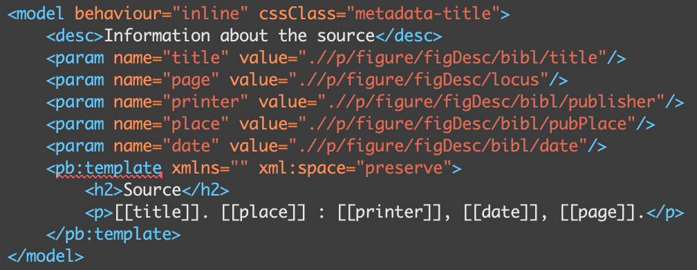
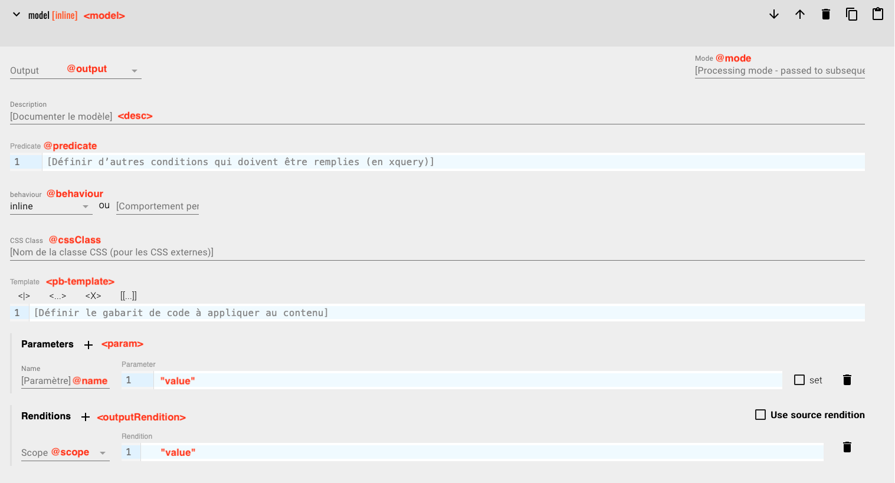
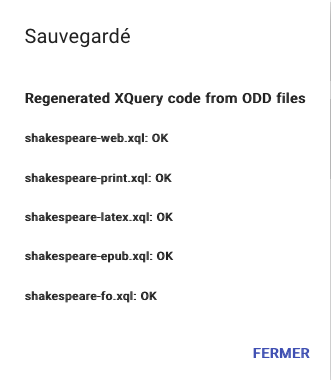

# ODD et TEI Processing Model

## 1. TEI Processing Model
### 1.1. Définition
Le *TEI Processing Model* est une spécification de la TEI qui permet d'indiquer directement dans l'ODD  la manière dont un document sera affiché. Il définit un ensemble de comportements par défaut pour transformer les éléments TEI. Ces comportements sont indépendants du média (*media-agnostic*). Ils visent aussi bien une sortie Web que PDF ou LaTeX.

Pour en savoir plus : [Chapitre 23 - Documentation Elements](https://www.tei-c.org/release/doc/tei-p5-doc/en/html/TD.html#TDPM) (TEI Guidelines)

### 1.2. Les *models*

**Model** (&lt;model&gt;) : Élément de base qui définit des règles de transformation à appliquer à un élément spécifique. 


Cet élément accepte plusieurs attributs :
- @behaviour : Précise le comportement d'un élément après la transformation. Exemples :
    - Block = &lt;div&gt;
    - Inline = &lt;span&gt;
    - Paragraph = &lt;p&gt;
    - Link = &lt;a&gt;
    - List = &lt;ul&gt;
    - List-item = &lt;li&gt;
    - Graphic = &lt;img/&gt; 
    - Etc.
- @predicate : Ajoute une condition (XPath) pour qu'une règle s'applique.


- @output : Permet d'associer une règle à une sortie spécifique. Par défaut, la TEI propose "web", "print" et "plain", mais TEI-Publisher offre d'autres possibilités ("fo", "latex", "epub"). (Voir [Documentation TEI-Publisher](https://teipublisher.com/exist/apps/tei-publisher/documentation/output-media?odd=docbook.odd&id=introduction&hash=3.12.17.5))
- @cssClass : Permet d'associer une classe CSS à un élément (feuille de style externe).
    - Votre feuille de style doit être sauvegardée dans le dossier "resources/odd". Dans le &lt;teiHeader&gt; de votre ODD, ajoutez ensuite la ligne suivante : 
```
<rendition source="styles_odd.css"/>
```


En fonction du *behaviour* choisi, vous pouvez lui associer des paramètres, par exemple, pour indiquer la source d'une image (@src) ou l'URL pour un lien (@href). Pour cela, il faut ajouter un élément &lt;param&gt; à &lt;model&gt;. Cet élément est réplicable : il faut autant de &lt;param&gt; que de paramètres. Il a deux principaux attributs :
- @name : Nom du paramètre
- @value : Valeur du paramètre (expression XPath ou XQuery)

Il existe des paramètres prédéfinis que vous retrouverez dans les [TEI Guidelines](https://www.tei-c.org/release/doc/tei-p5-doc/en/html/ref-param.html).


Trois autres éléments sont acceptés par l'élément &lt;model&gt; :
- &lt;desc&gt; : Permet de documenter chaque règle en en fournissant une rapide description.
- &lt;outputRendition&gt; :  Permet d'associer un style à un élément.
    - @scope : Indique un pseudo-element CSS (before, after, first-line, first-letter).
    - :warning: Quelle différence avec l'attribut @cssClass ? L'élément &lt;outputRendition&gt; ajoutera un attribut @style à votre élément HTML (*Inline style*), alors que @cssClass ajoutera un attribut @class.


- &lt;pb-template&gt; : Permet d'étendre le comportement par défaut. Il est possible de définir des paramètres supplémentaires à ajouter dans le template. Ces paramètres apparaitront entre des doubles crochets. Ex: &lt;p&gt;[[content]]&lt;/p&gt;



Plusieurs règles peuvent être appliquées à un élément. :warning: L'ordre des règles compte. La première condition validée est appliquée et les autres ne seront pas lues.


----------
**Model group** : Regroupe des modèles qui ont une sortie (*output*) en commun.

**Model sequence** : Combinaison de plusieurs modèles qui seront tous appliqués (ce ne sont pas des *models* alternatifs).


NB : Il est possible de personnaliser votre ODD et de créer vos propres *behaviours*. Voir [la documentation de TEI-Publisher](https://teipublisher.com/exist/apps/tei-publisher/documentation/extension-modules?odd=docbook.odd&id=introduction&hash=3.12.17.5).

## 2. L'éditeur d'ODD
Pour personnaliser l'ODD, vous pouvez soit la modifier directement dans le fichier, soit passer par l'éditeur développé par TEI-Publisher. Cet éditeur est uniquement accessible lorsque vous êtes connecté à votre application ("Fonctions avancées > Éditer l'ODD : MonODD.odd"). À gauche de l'écran, vous retrouverez la liste de tous les éléments actuellement dans votre ODD. Vous avez également la possibilité d'en ajouter de nouveaux. Chaque élément peut être individuellement paramétré pour s'adapter à vos besoins en termes d'affichage Web, PDF, ePub ou encore Latex. Il suffit pour cela de compléter les champs nécessaires dans le formulaire qui vous est proposé. Chaque champ correspond à un attribut ou à un élément du TEI Processing Model, vus précédemment.



Modifications manuelles ou éditeur d'ODD ? *It is up to you!* :warning: Si vous choisissez de coder directement dans le fichier XML, vous devez considèrer plusieurs points :
- Ne pas oublier l'attribut @mode de l'élément &lt;elementSpec&gt; avec pour valeur "change", afin d'indiquer à votre app que vous avez modifié les règles de cet élément ;
- Toujours enregistrer votre ODD 2 fois : une fois via votre éditeur XML (Oxygen ou Exide), puis une seconde fois via l'éditeur d'ODD de votre application ! En effet, lorsque vous cliquez sur l'icône d'enregistrement :floppy_disk: de l'éditeur d'ODD, les feuilles XSLT sont regénérées. Elles apparaissent dans le dossier "transform" de votre application. Si vous passez cette étape, les modifications que vous aurez apportées ne seront pas appliquées.




