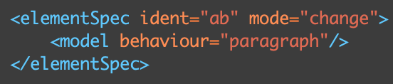
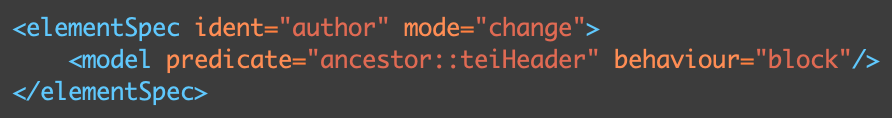
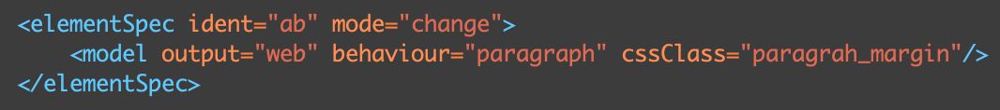
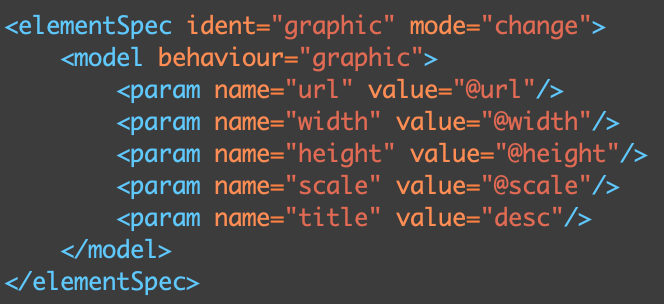
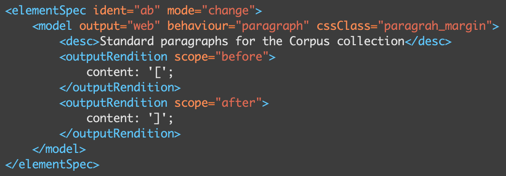
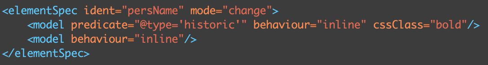
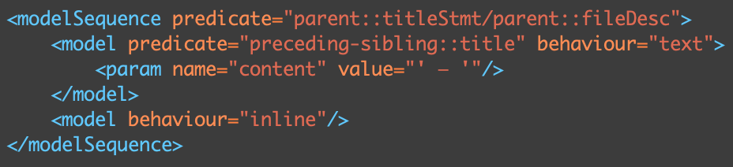

# ODD et TEI Processing Model

## 1. TEI Processing Model
### 1.1. Définition
(En cours)

Pour en savoir plus : [Chapitre 23 - Documentation Elements](https://www.tei-c.org/release/doc/tei-p5-doc/en/html/TD.html#TDPM) (TEI Guidelines)

### 1.2. Les *models*

**Model** (&lt;model&gt;) : Élément de base qui définit des règles de transformation à appliquer à un élément spécifique. Plusieurs règles peuvent être appliquées à un élément. :warning: L'ordre des règles compte. La première condition validée est appliquée et les autres ne seront pas lues.

Cet élément accepte plusieurs attributs :
- @behaviour : Précise le comportement d'un élément après la transformation. Exemples :
    - Block = &lt;div&gt;
    - Inline = &lt;span&gt;
    - Paragraph = &lt;p&gt;
    - Link = &lt;a&gt;
    - List = &lt;ul&gt;
    - List-item = &lt;li&gt;
    - Graphic = &lt;img/&gt; 
    - Etc.
- @predicate : Ajoute une condition (XPath) pour qu'une règle s'applique.

- @output : Permet d'associer une règle à une sortie spécifique. Par défaut, la TEI propose "web", "print" et "plain", mais TEI-Publisher offre d'autres possibilités ("fo", "latex", "epub"). (Voir [Documentation TEI-Publisher](https://teipublisher.com/exist/apps/tei-publisher/documentation/output-media?odd=docbook.odd&id=introduction&hash=3.12.17.5))
- @cssClass : Permet d'associer une classe CSS à un élément (feuille de style externe).
    - (Comment associer une feuille de style externe ?)

En fonction du *behaviour* choisi, vous pouvez lui associer des paramètres, par exemple, pour indiquer la source du image (@src) ou l'URL pour un lien (@href). Pour cela, il faut ajouter un élément &lt;param&gt; à &lt;model&gt;. Cet élément est réplicable : il faut autant de &lt;param&gt; que de paramètres. Il a deux principaux attributs :
- @name : Nom du paramètre
- @value : Valeur du paramètre (expression XPath ou XQuery)

Il existe des paramètres prédéfinis, que vous retrouverez dans les [TEI Guidelines](https://www.tei-c.org/release/doc/tei-p5-doc/en/html/ref-param.html), mais vous pouvez également créer les vôtres.

(Montrer à quoi ressemble la sortie en HTML).

Trois autres éléments sont acceptés par l'élément &lt;model&gt; :
- &lt;desc&gt; : Permet de documenter chaque règle en en fournissant une rapide description.
- &lt;outputRendition&gt; :  Permet d'associer un style à un élément.
    - @scope : Indique une pseudo-class CSS (before, after, first-line, first-letter).
    - :warning: Quelle différence avec l'attribut @cssClass ? L'élément &lt;outputRendition&gt; ajoutera un attribut @style à votre élément HTML (*Inline style*), alors que @cssClass ajoutera un attribut @class. (Montrer à quoi ça ressemble en HTML).

- &lt;pb-template&gt; : (En cours)

Plusieurs règles peuvent être appliquées à un élément. :warning: L'ordre des règles compte. La première condition validée est appliquée et les autres ne seront pas lues.

----------

**Model sequence** : Combinaison de plusieurs modèles qui seront tous appliqués (ce ne sont pas des *models* alternatifs).

**Model group** : Regroupe des modèles qui ont une sortie (*output*) en commun.

NB : Il est possible de personnaliser votre ODD et de créer vos propres behaviours. Voir [la documentation de TEI-Publisher](https://teipublisher.com/exist/apps/tei-publisher/documentation/extension-modules?odd=docbook.odd&id=introduction&hash=3.12.17.5).

## 2. L'éditeur d'ODD

