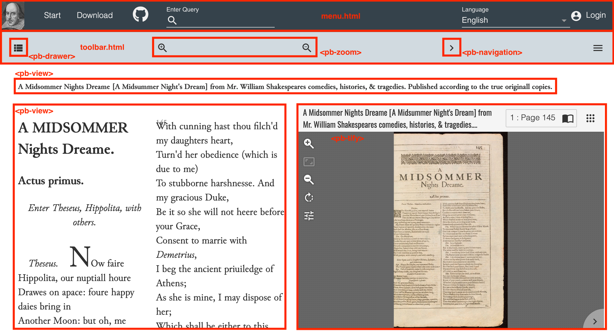

# Templates et webcomponents
## 1. Templates : Généralités
Si l'affichage des éditions est géré uniquement par l'ODD, l'affichage et l'organisation du site Web est géré par une série de templates. Ces derniers prennent la forme de fichiers .html et se trouvent dans le dossier ```/templates``` de votre application. Les fichiers à la racine concernent les pages et les fonctionnalités générales du site. Les fichiers permettant d'afficher les éditions se trouvent dans le dossier ```/pages```.
Ces templates sont "combinables". Ainsi, le menu de navigation se trouve dans le fichier ```menu.html``` et est appelé par les autres fichiers à l'aide de la ligne suivante :
```
<app-toolbar data-template="templates:include" data-template-path="templates/menu.html"/>
```

## 2. Les webcomponents
Les webcomponents (standard du W3C) sont des éléments HTML qui encapsulent des fonctionnalités et des styles prédéfinis. Ils permettent de simplifier la composition des pages, en limitant le nombre de lignes de code à écrire et en compartimentant les fonctionnalités, i.e. les styles attribués à un webcomponent ne se répercuteront pas sur le reste du site.
Chaque template est ainsi un mélange d'éléments HTML 5 standards et de webcomponents. Ceux-ci sont identifiables à leur préfixe :

- "pb-" : Webcomponents propres à TEI-Publisher
    - Liste des webcomponents : [https://cdn.tei-publisher.com/@2.23.2/dist/api.html](https://cdn.tei-publisher.com/@2.23.2/dist/api.html)  
- "app-", "paper-" et "iron-" : Webcomponents Polymer (Librarie Javascript)
    - Liste des webcomponents : [https://www.webcomponents.org/](https://www.webcomponents.org/)
    
Par exemple, l'insertion d'un outil de visualisation se fait à l'aide de ```<pb-facsimile>``` ou, plus récémment, de ```<pb-tify>``` ; d'un zoom avec ```<pb-zoom>``` ; d'une carte avec ```<pb-leaflet-map>``` ; de plusieurs colonnes avec ```<pb-panel>``` ; etc.
Une page se compose de plusieurs "blocs" qui communiquement les uns avec les autres, en envoyant des *events* et en s'inscrivant à des *channels*.

## 3. Anatomie d'un template : l'exemple de shakespeare.html


## 4. Exercices pratiques
### 4.1. Créer un nouveau template de page

1. Dans le dossier ```/templates/pages```, créer un nouveau fichier .html ;
1. Copier/coller la structure de **shakespeare.html** dans ce nouveau fichier ;
1. Dans **config.xqm**, modifier la ligne 93 en remplaçant shakespeare.html par le nom du nouveau template.
```
declare variable $config:default-template :="cuso.html";
```

### 4.2. Afficher des métadonnées

- Dans le template de page, ajouter un nouvel élément &lt;pb-view&gt; sur le modèle suivant :
```
<pb-view view="single" src="document1" subscribe="transcription" xpath="//teiHeader/fileDesc/sourceDesc" id="metadata">
    <pb-param name="view" value="metadata"/>
</pb-view>
```
- Dans le même template, ajouter la règle CSS suivante :
```
#metadata {
    flex: 1 1; 
}
```
- Dans votre ODD, créer un modelSequence pour l'élément &lt;sourceDesc&gt; avec les attributs suivants :
    - @predicate : ```$parameters?view='metadata'```
        - Ce prédicat est un paramètre externe (*external parameter*), qui permet de contrôler l'affichage d'une partie d'un fichier, en faisant appel à une fonction XQuery externe à l'ODD. Pour en savoir plus sur les paramètres externes et leurs potentialités, voir la [documentation](https://teipublisher.com/exist/apps/tei-publisher/documentation/external-parameters?odd=docbook.odd&id=introduction).
    - @output : web
- Dans ce modelSequence, ajouter un premier model pour afficher le titre :
    - @behaviour : block
    -  &lt;param&gt; : @name = content ; @value = ```.//title[@type="titulo_completo"]```
- Enrichir ce model avec un label précisant, sur le site, le type d'information :
    - Dans la champ 'Template' de l'éditeur d'ODD, ajouter ce code HTML : ```<span class="metadata_label">Titre : </span><span>[[content]]</span>```
        - NB : Dans votre ODD, ces informations apparaissent dans un élément &lt;pb-template&gt;. C'est un ajout de TEI-Publisher. Il permet d'étendre les comportements par défaut. Il est possible de définir des paramètres supplémentaires à ajouter dans le template. Ces paramètres apparaitront entre des doubles crochets. Ex: &lt;p&gt;[[content]]&lt;/p&gt;
    - Modifier la CSS de l'ODD pour faire apparaître le label en gras. 
- Ajouter un nouveau model au modelSequence de &lt;sourceDesc&gt; pour faire apparaître des informations sur la publication de l'imprimé :
    - @behviour : block
    - &lt;param&gt; :
        - @name = publisher ; @value = ```.//publisher```
        - @name = place ; @value = ```.//pubPlace```
        - @name = date ; @value = ```.//date```
    - &lt;pb-template&gt; : ```<span class="metadata_label">Imprint : </span><span>[[place]], [[publisher]], [[date]]</span>```

### 4.3. Afficher des infobulles pour les noms de lieux
- Dans l'éditeur d'ODD, modifier le @behaviour de l'élément &lt;name&gt; en 'alternate' ;
- Supprimer les anciens paramètres et ajouter les suivants :
    - @name = default ; @value = ```.```
    - @name = alternate ; @value =
```
let $corresp := substring-after(@corresp, "#")
let $index := doc('/db/apps/test-cuso/data/registers/places.xml')
let $xml-base := $index//listPlace/@xml:base 
let $id := $index//listPlace//placeName/@xml:id  
return if($corresp = $id)   
then $index//placeName[@xml:id=$corresp]/following-sibling::desc
else '#'
```

- Modifier la feuille de style de l'ODD :

```.link-place {
    color: #86187a;
    text-decoration: underline dotted;
    cursor: help;
}```